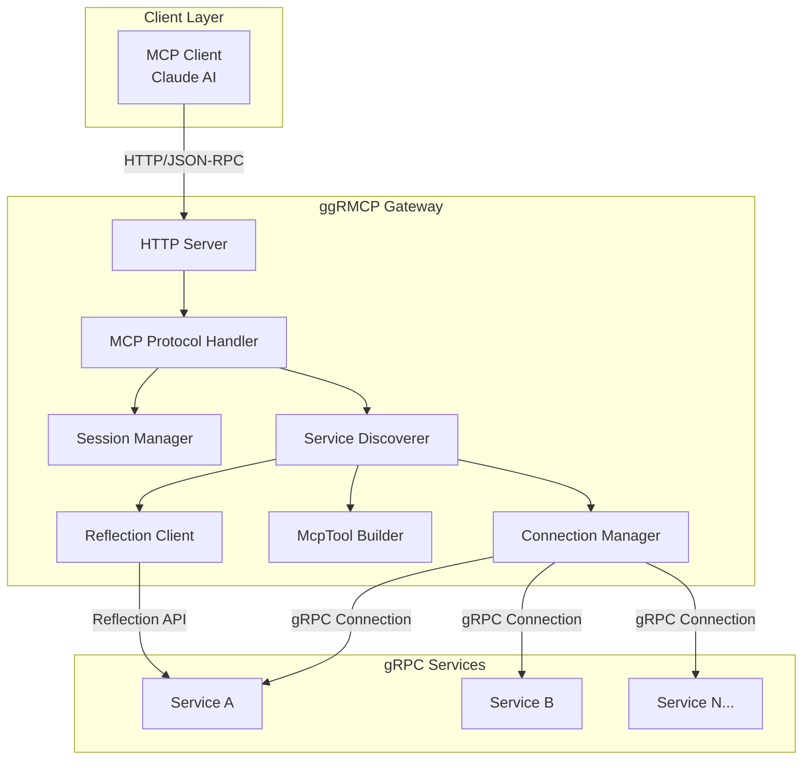
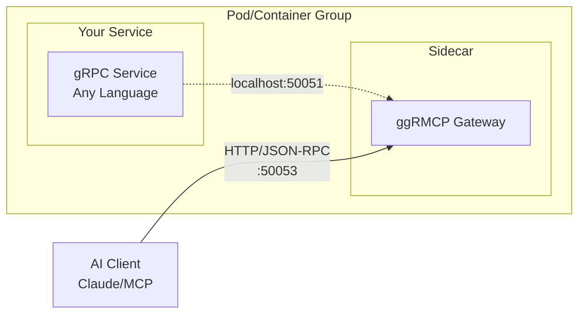
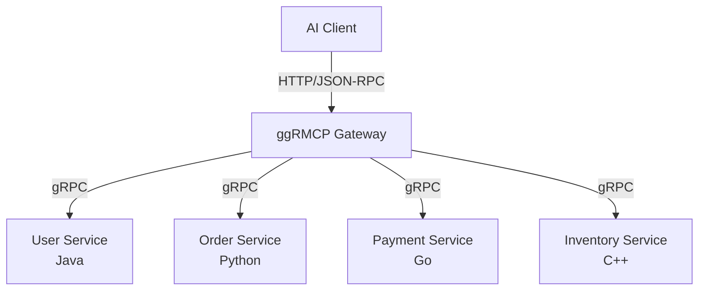
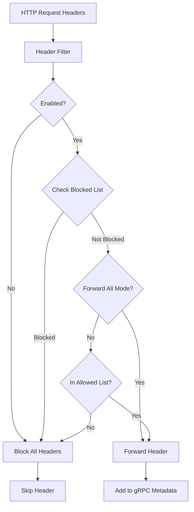
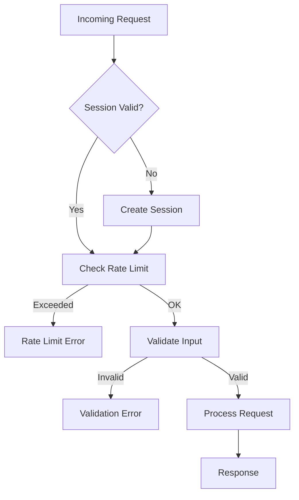

# ggRMCP - gRPC to MCP Gateway

[](https://github.com/lysfighting/ggRMCP/actions/workflows/ci.yml)
[](https://github.com/lysfighting/ggRMCP/actions/workflows/security.yml)
[](https://goreportcard.com/report/github.com/lysfighting/ggRMCP)
[](LICENSE)

## 🎯 What is ggRMCP?

ggRMCP is a high-performance Go-based gateway that converts gRPC services into MCP-compatible tools, allowing AI models like Claude to directly call your gRPC services. It acts as a translator between the gRPC world and the MCP ecosystem, providing seamless integration without requiring modifications to existing gRPC services.

ggRMCP uses [gRPC reflection](https://grpc.io/docs/guides/reflection/) to discover available services and methods, generating MCP tools dynamically. This enables AI applications to interact with gRPC services as if they were native tools, enhancing the capabilities of AI models with real-time data access and processing.

ggRMCP can also be configured to read [FileDescriptorSet files](https://buf.build/docs/reference/descriptors/), enabling it to extract comments and documentation from protobuf definitions for a richer AI application experience.

This allows you to leverage existing gRPC services without needing to rewrite or adapt them for AI use cases, making it easier to integrate AI capabilities into your applications.

## 🚨 Disclaimer
ggRMCP is an experimental project and is not yet production-ready.

**Deployment Patterns:**
- **🐳 Sidecar Proxy**: Deploy alongside your gRPC service in any language (Java, Python, C++, Go, etc.)
- **🌐 Centralized Gateway**: Single instance serving multiple gRPC backends

The transcoding is performed in real-time with no modifications required to existing gRPC services. As a language-agnostic sidecar, ggRMCP works with gRPC services written in any language that supports gRPC reflection.

## 📋 Model Context Protocol (MCP)

MCP is an open protocol that standardizes how applications provide context to LLMs. Think of MCP like a USB-C port for AI applications - it provides a standardized way to connect AI models to different data sources and tools.

### How ggRMCP Uses MCP
- **Tool Registration**: Each gRPC method becomes an MCP tool
- **Schema Definition**: Protobuf schemas are converted to JSON schemas  
- **Request/Response Handling**: Automatic translation between JSON and protobuf
- **Error Handling**: Standardized error responses following MCP specifications
- **Header Forwarding**: HTTP headers are securely forwarded to gRPC services

## 🌟 Key Features

### Core Capabilities
- **🌍 Language Agnostic**: Works as a sidecar with gRPC services in any language
- **🔌 Seamless Integration**: Connect existing gRPC services to AI applications without modification
- **🚀 Sidecar Ready**: Deploy alongside your service containers with zero code changes
- **📡 Dynamic Service Discovery**: Automatic gRPC service discovery using gRPC server reflection or FileDescriptorSet
- **🔄 Real-time Tool Generation**: Dynamic MCP tool generation from gRPC service definitions with comment extraction
- **📝 Schema Validation**: Automatic request/response validation using protobuf schemas
- **🧠 Session Management**: Stateful session handling for complex AI interactions
- **📨 Header Forwarding**: Configurable HTTP header forwarding to gRPC services with security filtering
- **📋 FileDescriptorSet Support**: Rich tool schemas with comments and documentation from .binpb descriptor files

## 🏗️ Architecture



### Core Components

| Component | Location | Purpose |
|-----------|----------|---------|
| **Connection Manager** | `pkg/grpc/connection.go` | Manages gRPC connections with health checking and reconnection |
| **Service Discoverer** | `pkg/grpc/discovery.go` | Discovers and manages gRPC services |
| **Reflection Client** | `pkg/grpc/reflection.go` | Handles gRPC reflection API for service discovery |
| **MCP Handler** | `pkg/server/handler.go` | Implements MCP protocol over HTTP |
| **Session Manager** | `pkg/session/manager.go` | Manages user sessions with rate limiting |
| **Tool Builder** | `pkg/tools/builder.go` | Generates JSON schemas from protobuf definitions |
| **Header Filter** | `pkg/headers/filter.go` | Filters and forwards HTTP headers to gRPC services |
| **Configuration** | `pkg/config/config.go` | Centralized configuration management |

## 🚀 Deployment Patterns

### Sidecar Pattern

Deploy ggRMCP as a sidecar container alongside your gRPC service:



**Benefits:**
- ✅ Zero code changes to existing services
- ✅ Works with any language (Java, Python, C++, Go, etc.)
- ✅ Isolated from service failures
- ✅ Independent scaling and updates


### Centralized Gateway Pattern

Single ggRMCP instance serving multiple gRPC backends:



## 🏁 Quick Start

### Prerequisites
- Go 1.23 or higher
- A running gRPC server with reflection enabled (example service provided)
- `make` for building (optional)
- `protoc` for generating FileDescriptorSet files (optional)

### Option A: Quick Start with Hello Service Example

The fastest way to test ggRMCP is using the included hello-service example:

#### 1. Clone and Build
```bash
git clone https://github.com/lysfighting/ggRMCP
cd ggRMCP
go mod download
go build -o build/grmcp ./cmd/grmcp
```

#### 2. Start the Hello Service
```bash
cd examples/hello-service

# Build and run the hello service (default port 50051)
make run

# OR manually:
# go build -o hello-service .
# ./hello-service

# OR run on a custom port:
# ./hello-service --port=50052
```

This starts a gRPC service on `localhost:50051` (or custom port) with reflection enabled and a `SayHello` method.

#### 3. Start ggRMCP Gateway

Choose one of the following options:

**Option a: Using gRPC Reflection**
```bash
# From the project root
./build/grmcp --grpc-host=localhost --grpc-port=50051 --http-port=50053 --log-level=debug
```

**Option b: Using FileDescriptorSet (Enhanced Schemas with Comments)**
```bash
# Generate the FileDescriptorSet with comments
cd examples/hello-service
make descriptor

# Start gateway with descriptor file (from project root)
cd ../../
./build/grmcp --grpc-host=localhost --grpc-port=50051 --http-port=50053 --descriptor=examples/hello-service/build/hello.binpb --log-level=debug
```

#### 4. Test the Gateway
```bash
# Check health
curl http://localhost:50053/health

# List available tools (should show hello_helloservice_sayhello)
curl -X POST http://localhost:50053/ \
  -H "Content-Type: application/json" \
  -d '{"jsonrpc":"2.0","method":"tools/list","id":1}'

# Call the SayHello method
curl -X POST http://localhost:50053/ \
  -H "Content-Type: application/json" \
  -d '{"jsonrpc":"2.0","method":"tools/call","id":2,"params":{"name":"hello_helloservice_sayhello","arguments":{"name":"World","email":"test@example.com"}}}'
```

#### 5. Hello Service Makefile Commands
```bash
cd examples/hello-service

make install-tools # Install protobuf tools (protoc-gen-go, protoc-gen-go-grpc)
make setup         # Install tools and generate protobuf files  
make build         # Build the hello service binary
make run           # Build and run the service
make proto         # Generate protobuf Go files
make descriptor    # Generate FileDescriptorSet for ggRMCP
make clean         # Clean build artifacts
make help          # Show available targets
```

## 🔗 Connect to Claude Desktop

1. **Install MCP remote client:**
```bash
npm install -g mcp-remote
```

2. **Configure Claude Desktop** - Add to your MCP configuration file:
   - **macOS**: `~/Library/Application Support/Claude/claude_desktop_config.json`
   - **Windows**: `%APPDATA%/Claude/claude_desktop_config.json`

```json
{
  "mcpServers": {
    "grpc-gateway": {
      "command": "mcp-remote",
      "args": ["http://localhost:50053"],
      "env": {}
    }
  }
}
```

3. **Restart Claude Desktop** to apply the configuration.

4. **Test the connection** - Claude should now have access to your gRPC service methods as tools. You can:
   - Ask Claude to list available tools
   - Call specific gRPC methods  
   - Handle complex request/response data

## ✅ Verify Everything Works

```bash
# Check gateway health
curl http://localhost:50053/health

# List available tools via MCP
curl -X POST http://localhost:50053/ \
  -H "Content-Type: application/json" \
  -d '{"jsonrpc":"2.0","method":"tools/list","id":1}'

# Test calling the hello service
curl -X POST http://localhost:50053/ \
  -H "Content-Type: application/json" \
  -d '{"jsonrpc":"2.0","method":"tools/call","id":2,"params":{"name":"hello_helloservice_sayhello","arguments":{"name":"Test","email":"test@example.com"}}}'
```

## 🔧 Configuration

### Command Line Options

```bash
./build/grmcp --help
```

| Flag | Default | Description |
|------|---------|-------------|
| `--grpc-host` | `localhost` | gRPC server hostname |
| `--grpc-port` | `50051` | gRPC server port |
| `--http-port` | `50053` | HTTP server port for MCP gateway |
| `--log-level` | `info` | Logging level (debug, info, warn, error) |
| `--dev` | `false` | Enable development mode with detailed logging |
| `--descriptor` | `""` | Path to protobuf FileDescriptorSet file (.binpb) for enhanced schemas |

### Example Commands

```bash
# Basic usage
./build/grmcp --grpc-host=localhost --grpc-port=50051

# With custom ports and debug logging
./build/grmcp --grpc-host=127.0.0.1 --grpc-port=9090 --http-port=8080 --log-level=debug

# Using FileDescriptorSet with development mode
./build/grmcp --grpc-host=localhost --grpc-port=50051 --descriptor=service.binpb --dev
```

## 🚀 How It Works

### 1. Service Discovery
ggRMCP supports two methods for discovering gRPC services:
- **gRPC Reflection**: Dynamic service discovery from running gRPC servers
- **FileDescriptorSet**: Pre-compiled .binpb files with rich comment extraction
- **Schema Generation**: Protobuf message definitions converted to JSON schemas with documentation
- **Tool Registration**: Each gRPC method becomes an available MCP tool

### 2. Tool Generation
Each discovered gRPC method becomes an MCP tool with:
- **Input Schema**: Generated from protobuf message definitions
- **Output Schema**: Automatic response type mapping  
- **Validation**: Built-in request/response validation
- **Documentation**: Method and parameter descriptions

### 3. Request Translation
- **JSON to Protobuf**: Incoming JSON requests are validated and converted to protobuf
- **Header Filtering**: HTTP headers are securely filtered and forwarded as gRPC metadata
- **gRPC Invocation**: Native gRPC calls to backend services
- **Response Conversion**: Protobuf responses converted back to JSON
- **Error Handling**: gRPC errors mapped to MCP error format

## 📋 FileDescriptorSet Support

ggRMCP supports loading protobuf FileDescriptorSet files (.binpb) to extract rich documentation and comments from your protobuf definitions. This feature provides enhanced tool schemas with meaningful descriptions for services, methods, and fields.

### Generating FileDescriptorSet Files

```bash
# Generate FileDescriptorSet from your .proto files
protoc --descriptor_set_out=service.binpb \
       --include_source_info \
       --include_imports \
       --proto_path=/path/to/protos \
       your_service.proto

# Use with ggRMCP
./build/grmcp --grpc-host=localhost --grpc-port=50051 --descriptor=service.binpb
```

### Example: Enhanced Schema Output

**With Reflection Only:**
```json
{
  "name": "user_service_get_user",
  "description": "Calls the GetUser method of the user.UserService service",
  "inputSchema": {
    "type": "object",
    "properties": {
      "user_id": {"type": "string"}
    }
  }
}
```

**With FileDescriptorSet:**
```json
{
  "name": "user_service_get_user", 
  "description": "Retrieves user information by ID with full profile data",
  "inputSchema": {
    "type": "object",
    "properties": {
      "user_id": {
        "type": "string",
        "description": "Unique identifier for the user account"
      }
    }
  }
}
```

## 🛡️ Security Features

### Header Forwarding

ggRMCP includes advanced header forwarding capabilities with security-focused filtering:



**Default Security Settings:**
- **Blocked Headers**: `cookie`, `set-cookie`, `host`, `content-length`, `mcp-session-id`
- **Allowed Headers**: `authorization`, `x-trace-id`, `user-agent`, `x-request-id`
- **Case Insensitive**: Headers are matched case-insensitively by default
- **ForwardAll Disabled**: Only explicitly allowed headers are forwarded

### Input Validation & Rate Limiting



### Security Layers

- **Session Management**: UUID-based session tracking with expiration
- **Rate Limiting**: Per-session and global rate limiting
- **Input Validation**: JSON-RPC and parameter validation
- **Error Sanitization**: Prevents information disclosure
- **Security Headers**: CORS, CSP, and other protective headers

## 📊 Monitoring & Health Checks

### Available Endpoints

| Endpoint | Method | Purpose |
|----------|--------|---------|
| `/` | `GET` | MCP capability discovery |
| `/` | `POST` | JSON-RPC method calls |
| `/health` | `GET` | Health check and service status |
| `/metrics` | `GET` | Service statistics and metrics |

### Health Check Response

```json
{
  "status": "healthy",
  "timestamp": "2024-01-01T12:00:00Z",
  "serviceCount": 3,
  "methodCount": 15
}
```

## 🧪 Testing

### Unit Tests

```bash
# Run all tests
make test

# Run tests with coverage
go test -race -coverprofile=coverage.out ./...
go tool cover -html=coverage.out
```

### Integration Tests

```bash
# Run integration tests (requires running gRPC service)
go test -tags=integration ./tests/...
```

### Manual Testing

```bash
# List available tools
curl -X POST http://localhost:50053/ \
  -H "Content-Type: application/json" \
  -d '{"jsonrpc":"2.0","method":"tools/list","id":1}'

# Call the hello service example
curl -X POST http://localhost:50053/ \
  -H "Content-Type: application/json" \
  -d '{"jsonrpc":"2.0","method":"tools/call","id":2,"params":{"name":"hello_helloservice_sayhello","arguments":{"name":"Test User","email":"user@example.com"}}}'
```

## 🔧 Development

### Development Setup

```bash
# Install development tools
make install-tools

# Run linting
make lint

# Run tests with race detection
make test-race

# Build and run in development mode
make dev
```

## 🐛 Troubleshooting

### Common Issues

**1. Port already in use**
```bash
# Check what's using the port
lsof -ti:50051

# Kill the process
kill $(lsof -ti:50051)
```

**2. Protobuf generation fails**
```bash
# Install protobuf tools manually
go install google.golang.org/protobuf/cmd/protoc-gen-go@latest
go install google.golang.org/grpc/cmd/protoc-gen-go-grpc@latest

# Make sure protoc is installed
brew install protobuf  # macOS
# or apt-get install protobuf-compiler  # Ubuntu
```

**3. gRPC service not discovered**
- Ensure your gRPC service has reflection enabled
- Check that the service is listening on the specified host:port
- Verify firewall settings allow connections

**4. MCP connection issues**
- Restart Claude Desktop after configuration changes
- Check the MCP configuration file path is correct
- Verify the ggRMCP gateway is running and accessible

## 🤝 Contributing

This project is in active development. Contributions are welcome!

### How to Contribute

1. Fork the repository
2. Create a feature branch (`git checkout -b feature/amazing-feature`)
3. Make your changes
4. Add tests for new functionality
5. Run the test suite (`make test`)
6. Commit your changes (`git commit -m 'Add amazing feature'`)
7. Push to the branch (`git push origin feature/amazing-feature`)
8. Open a Pull Request

### Development Guidelines

- Follow Go best practices and idioms
- Add comprehensive tests for new features
- Update documentation for API changes
- Use conventional commit messages
- Ensure all CI checks pass

## 📄 License

This project is licensed under the MIT License - see the [LICENSE](LICENSE) file for details.

## 🙏 Acknowledgments

- [Model Context Protocol](https://github.com/modelcontextprotocol/specification) for making this project possible ;-)
- [gRPC](https://grpc.io/) community for the robust RPC framework
- [Go](https://golang.org/) team for the exceptional programming language

## 🔗 Related Projects

This Go implementation is part of a family of gRPC-to-MCP gateways:
- **[GrMCP (Java)](https://github.com/lysfighting/grmcp)**: The original Java implementation


## 📞 Support & Contact

- **Issues**: Please use [GitHub Issues](https://github.com/lysfighting/ggRMCP/issues) for bug reports and feature requests
- **Discussions**: Use [GitHub Discussions](https://github.com/lysfighting/ggRMCP/discussions) for questions and community chat
- **Security**: For security-related issues, please email ahmad.alobaidy@gmail.com

---

